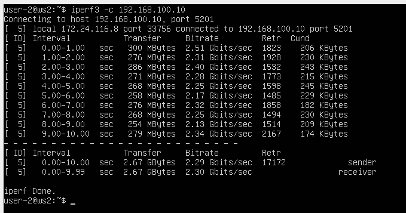
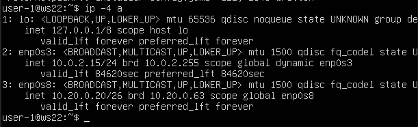
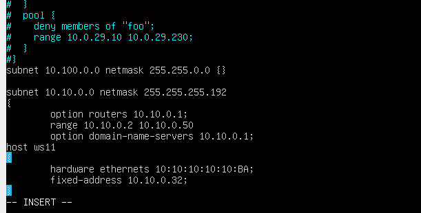

# PART 1
## 1.1. Сети и маски
### 1 
Адрес - 192.160.0.0  

### 2 
#### 255.255.255.0 в префиксную и двоичную запись:  
  
- Префиксная запись: /24
- Двоичная запись: 11111111.11111111.11111111.00000000  
#### /15 в обычную и двоичную запись:
  
- Обычная запись: 255.254.0.0
- Двоичная запись: 11111111.11111110.00000000.00000000  
#### 11111111.11111111.11111111.11110000 в обычную и префиксную запись:  
  
- Обычная запись: 255.255.255.240
- Префиксная запись: /28
### 3
#### /8:  
  
- min: 12.0.0.1
- max: 12.255.255.254  
##### /16:  
  
- min: 12.167.0.1
- max: 12.167.255.254  
#### 255.255.254.0:  
  
- min: 12.167.38.1
- max: 12.167.39.254   
#### /4:  
  
- min: 0.0.0.1
- max: 15.255.255.254
## 1.2. localhost
Адреса на localhost должны находиться в диапазоне 127.0.0.1 - 127.255.255.254  
1. 194.34.23.100: Нет
2. 127.0.0.2: Да
3. 127.1.0.1: Да
4. 128.0.0.1: Нет
## 1.3. Диапазоны и сегменты сетей
### 1 
Частные IP адреса:  
от 10.0.0.0 до 10.255.255.255 с маской 255.0.0.0 или /8;
от 172.16.0.0 до 172.31.255.255 с маской 255.240.0.0 или /12
от 192.168.0.0 до 192.168.255.255 с маской 255.255.0.0 или /16
от 100.64.0.0 до 100.127.255.255 с маской подсети 255.192.0.0 или /10  
1. 10.0.0.45 - частный
2. 134.43.0.2 - публичный
3. 192.168.4.2 - частный
4. 172.20.250.4 - частный
5. 172.0.2.1 - публичный
6. 192.172.0.1 - публичный
7. 172.68.0.2 - публичный
8. 172.16.255.255 - частный
9. 10.10.10.10 - частный
10. 192.169.168.1 - публичный
### 2
  
Диапазон доступных сетей: 10.10.0.1 - 10.10.63.254
1. 10.10.0.2 да
2. 10.10.10.10 да
3. 10.10.1.255 да
4. 10.0.0.1 нет
5. 10.10.100.1 нет


# PART 2. Статическая маршрутизация между двумя машинами  
- Подними две виртуальные машины (далее -- ws1 и ws2).
- С помощью команды ip a посмотри существующие сетевые интерфейсы.  


- Опиши сетевой интерфейс, соответствующий внутренней сети, на обеих машинах и задать следующие адреса и маски: ws1 - 192.168.100.10, маска /16, ws2 - 172.24.116.8, маска /12.  
- Выполни команду netplan apply для перезапуска сервиса сети.  


## 2.1. Добавление статического маршрута вручную  
- Добавь статический маршрут от одной машины до другой и обратно при помощи команды вида ip r add.
- Пропингуй соединение между машинами.  


## 2.2. Добавление статического маршрута с сохранением  
- Перезапусти машины. 
- Добавь статический маршрут от одной машины до другой с помощью файла etc/netplan/00-installer-config.yaml.  


- Пропингуй соединение между машинами.  


# PART 3. Утилита iperf3 
## 3.1. Скорость соединения 
- Переведи и запиши в отчёт: 8 Mbps в MB/s, 100 MB/s в Kbps, 1 Gbps в Mbps.  
1) 8 Mbps = 1 MB/s
2) 100 MB/s = 819200 Kbps
3) 1 Gbps = 1024 Mbps 
## 3.2. Утилита iperf3  
- Измерь скорость соединения между ws1 и ws2.  




# PART 4. Сетевой экран  
## 4.1. Утилита iptables
- Создай файл /etc/firewall.sh, имитирующий фаерволл, на ws1 и ws2:
``` 
#!/bin/sh

# Удаление всех правил в таблице «filter» (по-умолчанию).
iptables -F
iptables -X
```
- Нужно добавить в файл подряд следующие правила:

1) На ws1 примени стратегию, когда в начале пишется запрещающее правило, а в конце пишется разрешающее правило (это касается пунктов 4 и 5).

2) На ws2 примени стратегию, когда в начале пишется разрешающее правило, а в конце пишется запрещающее правило (это касается пунктов 4 и 5).

3) Открой на машинах доступ для порта 22 (ssh) и порта 80 (http).

4) Запрети echo reply (машина не должна «пинговаться», т.е. должна быть блокировка на OUTPUT).

5) Разреши echo reply (машина должна «пинговаться»).  


- Запусти файлы на обеих машинах командами chmod +x /etc/firewall.sh и /etc/firewall.sh.  


Разница между стратегиями заключается в очередности запрета/разрешения echo reply. Учитывается только последняя команда.

## 4.2. Утилита nmap  
- Командой ping найди машину, которая не «пингуется», после чего утилитой nmap покажи, что хост машины запущен.  


# PART 5. Статическая маршрутизация сети 
- Подними пять виртуальных машин (3 рабочие станции (ws11, ws21, ws22) и 2 роутера (r1, r2)).  


## 5.1. Настройка адресов машин
- Настрой конфигурации машин в etc/netplan/00-installer-config.yaml согласно сети на рисунке.  


- Перезапусти сервис сети. Если ошибок нет, то командой ip -4 a проверь, что адрес машины задан верно. Также пропингуй ws22 с ws21. Аналогично пропингуй r1 с ws11.  
перезaпускаю сервис сети командой sudo netplan apply  





## 5.2. Включение переадресации IP-адресов

- Для включения переадресации IP, выполни команду на роутерах:  
```sysctl -w net.ipv4.ip_forward=1```  
При таком подходе переадресация не будет работать после перезагрузки системы.
- Открой файл /etc/sysctl.conf и добавь в него следующую строку:  
```net.ipv4.ip_forward = 1```  
При использовании этого подхода, IP-переадресация включена на постоянной основе.  


## 5.3. Установка маршрута по-умолчанию  
Пример вывода команды ip r после добавления шлюза:
```
default via 10.10.0.1 dev eth0
10.10.0.0/18 dev eth0 proto kernel scope link src 10.10.0.2
```
- Настрой маршрут по-умолчанию (шлюз) для рабочих станций. Для этого добавь default перед IP роутера в файле конфигураций.  


- Вызови ip r и покажи, что добавился маршрут в таблицу маршрутизации.  


- Пропингуй с ws11 роутер r2 и покажи на r2, что пинг доходит. Для этого используй команду:  
```tcpdump -tn -i eth0```  


## 5.4. Добавление статических маршрутов  
- Добавь в роутеры r1 и r2 статические маршруты в файле конфигураций. Пример для r1 маршрута в сетку 10.20.0.0/26:  
```
# Добавь в конец описания сетевого интерфейса eth1:
- to: 10.20.0.0
  via: 10.100.0.12  
```   


- Вызови ip r и покажи таблицы с маршрутами на обоих роутерах:  

 

- Запусти команды на ws11:  
```ip r list 10.10.0.0/[маска сети]``` и ```ip r list 0.0.0.0/0```  


Маршрут по умолчанию имеет более низкий приоритет, а для 10.10.0.0/18 был найден подходящий маршрут в таблице маршрутизации, соответственно и был использован  

## 5.5. Построение списка маршрутизаторов  
 - Запусти на r1 команду дампа:  
```tcpdump -tnv -i eth0```  
- При помощи утилиты traceroute построй список маршрутизаторов на пути от ws11 до ws21.  


## 5.6. Использование протокола ICMP при маршрутизации  
- Запусти на r1 перехват сетевого трафика, проходящего через eth0 с помощью команды:  
```tcpdump -n -i eth0 icmp```  


 

# PART 6. Динамическая настройка IP с помощью DHCP
- Для r2 настрой в файле /etc/dhcp/dhcpd.conf конфигурацию службы DHCP:  
1) **Укажи адрес маршрутизатора по-умолчанию, DNS-сервер и адрес внутренней сети. Пример файла для r2:**   
```
subnet 10.100.0.0 netmask 255.255.0.0 {}

subnet 10.20.0.0 netmask 255.255.255.192
{
    range 10.20.0.2 10.20.0.50;
    option routers 10.20.0.1;
    option domain-name-servers 10.20.0.1;
}
```  


2) **В файле resolv.conf пропиши nameserver 8.8.8.8.**  


- Перезагрузи службу DHCP командой systemctl restart isc-dhcp-server. Машину ws21 перезагрузи при помощи reboot и через ip a покажи, что она получила адрес. Также пропингуй ws22 с ws21.  


- Укажи MAC адрес у ws11, для этого в etc/netplan/00-installer-config.yaml надо добавить строки: macaddress: 10:10:10:10:10:BA, dhcp4: true.  


- Для r1 настрой аналогично r2, но сделай выдачу адресов с жесткой привязкой к MAC-адресу (ws11). Проведи аналогичные тесты.  




- Запроси с ws21 обновление ip адреса.  


# PART 7. NAT  
- В файле /etc/apache2/ports.conf на ws22 и r1 измени строку Listen 80 на Listen 0.0.0.0:80, то есть сделай сервер Apache2 общедоступным.  


- Запусти веб-сервер Apache командой service apache2 start на ws22 и r1.  


- Добавь в фаервол, созданный по аналогии с фаерволом из Части 4, на r2 следующие правила:  

1) Удаление правил в таблице filter - iptables -F;  
2) Удаление правил в таблице "NAT" - iptables -F -t nat;  
3) Отбрасывать все маршрутизируемые пакеты - iptables --policy FORWARD DROP.  

Запусти файл также, как в Части 4.  


- Проверь соединение между ws22 и r1 командой ping.  


4) Разрешить маршрутизацию всех пакетов протокола ICMP.  


- Запусти файл также, как в Части 4.

- Проверь соединение между ws22 и r1 командой ping.  
 

- Добавь в файл ещё два правила

5) Включи SNAT, а именно маскирование всех локальных ip из локальной сети, находящейся за r2 (по обозначениям из Части 5 - сеть 10.20.0.0).  

6) Включи DNAT на 8080 порт машины r2 и добавить к веб-серверу Apache, запущенному на ws22, доступ извне сети.  


- Запусти файл также, как в Части 4.
- Проверь соединение по TCP для SNAT: для этого с ws22 подключиться к серверу Apache на r1 командой:   
```telnet [адрес] [порт]```  


- Проверь соединение по TCP для DNAT: для этого с r1 подключиться к серверу Apache на ws22 командой telnet (обращаться по адресу r2 и порту 8080).  


## PART 8. Дополнительно. Знакомство с SSH Tunnels

- Запусти на r2 фаервол с правилами из Части 7.  


- Запусти веб-сервер Apache на ws22 только на localhost (то есть в файле /etc/apache2/ports.conf измени строку Listen 80 на Listen localhost:80).  


- Воспользуйся Local TCP forwarding с ws21 до ws22, чтобы получить доступ к веб-серверу на ws22 с ws21.
- Воспользуйся Remote TCP forwarding c ws11 до ws22, чтобы получить доступ к веб-серверу на ws22 с ws11.
- Для проверки, сработало ли подключение в обоих предыдущих пунктах, перейди во второй терминал (например, клавишами Alt + F2) и выполни команду:  
```telnet 127.0.0.1 [локальный порт]```  
  
  
  
  